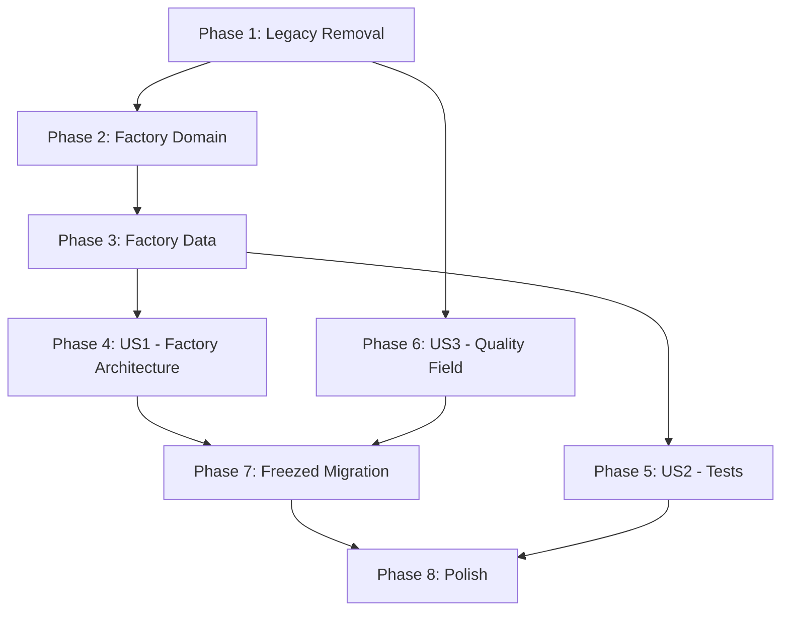

# Tasks: SOP Alignment

**Input**: Design documents from `/specs/001-sop-comparison/`
**Prerequisites**: plan.md ✅, spec.md ✅, research.md ✅, data-model.md ✅

## Format: `[ID] [P?] [Story] Description`

- **[P]**: Can run in parallel (different files, no dependencies)
- **[Story]**: Which user story this task belongs to (e.g., US1, US2)

---

## Phase 1: Setup (Legacy Code Removal)

**Purpose**: Remove dead code and fix misleading file names. This is a prerequisite
because renamed imports propagate to all subsequent phases.

- [X] T001 Delete dead OTP page at `lib/features/auth/presentation/pages/otp_page.dart`
- [X] T002 [P] Rename `lib/features/auth/presentation/pages/phone_auth_page.dart` → `email_auth_page.dart` and update import in `lib/core/router/app_router.dart`
- [X] T003 [P] Rename `lib/features/auth/domain/usecases/send_otp_usecase.dart` → `auth_usecases.dart` and update imports in `lib/core/di/injection.dart` and `lib/features/auth/presentation/cubit/auth_cubit.dart`
- [X] T004 Delete stale scaffold test at `test/widget_test.dart`
- [X] T005 Remove dead `otp` route from `lib/core/router/app_router.dart`

**Checkpoint**: `flutter analyze` should pass. No references to "otp" or "phone_auth" remain in codebase.

---

## Phase 2: Foundational (Factory Domain Layer)

**Purpose**: Build factory module's domain layer — the architectural foundation
that all factory features depend on.

**⚠️ CRITICAL**: Factory presentation work (Phase 4) cannot begin until this is complete.

- [X] T006 Create `FactoryProfileEntity` in `lib/features/factory/domain/entities/factory_profile_entity.dart` per data-model.md (id, ownerId, name, city, specialties, minQuantity, leadTimeDays, rating, reviewCount, coverImageUrl, portfolioImages, isFastResponder)
- [X] T007 [P] Create abstract `FactoryProfileRepository` in `lib/features/factory/domain/repositories/factory_profile_repository.dart` with methods: `getProfile(ownerId)`, `createProfile(entity)`, `updateProfile(entity)` returning `Future<Either<String, T>>`
- [X] T008 [P] Create `GetFactoryProfileUseCase` in `lib/features/factory/domain/usecases/get_factory_profile_usecase.dart`
- [X] T009 [P] Create `CreateFactoryProfileUseCase` in `lib/features/factory/domain/usecases/create_factory_profile_usecase.dart`
- [X] T010 [P] Create `UpdateFactoryProfileUseCase` in `lib/features/factory/domain/usecases/update_factory_profile_usecase.dart`

**Checkpoint**: Domain layer complete. All use cases compile and have clear contracts.

---

## Phase 3: Foundational (Factory Data Layer)

**Purpose**: Build factory module's data layer — connects domain contracts to Supabase.

- [X] T011 Create `FactoryProfileModel` in `lib/features/factory/data/models/factory_profile_model.dart` with `fromJson`/`toJson` mapping to Supabase `factories` table, and `toEntity()`/`fromEntity()` converters
- [X] T012 [P] Create `FactoryProfileRemoteDataSource` (abstract + impl) in `lib/features/factory/data/datasources/factory_profile_remote_datasource.dart` with CRUD operations against `public.factories` via SupabaseClient
- [X] T013 Create `FactoryProfileRepositoryImpl` in `lib/features/factory/data/repositories/factory_profile_repository_impl.dart` implementing the abstract repository, mapping data models ↔ entities
- [X] T014 Create `FactoryProfileCubit` with states (Initial, Loading, Loaded, NotFound, Created, Updated, Error) in `lib/features/factory/presentation/cubit/factory_profile_cubit.dart`
- [X] T015 Register all new factory dependencies in `lib/core/di/injection.dart`: datasource, repository, use cases, cubit

**Checkpoint**: Factory data/domain/presentation(cubit) wired. `flutter analyze` passes.

---

## Phase 4: User Story 1 — SOP Gap Detection & Alignment (Priority: P1) 🎯 MVP

**Goal**: Factory module has full clean architecture; factory onboarding flow works end-to-end.

**Independent Test**: Factory user can sign up → see profile setup → fill form → land on dashboard.

### Implementation for User Story 1

- [x] T016 [US1] Extract `FactoryDashboardPage` class from `lib/features/factory/presentation/pages/factory_shell_page.dart` (lines 119–295) into `lib/features/factory/presentation/pages/factory_dashboard_page.dart`
- [x] T017 [P] [US1] Extract `FactoryRequestsPage` + `_FactoryRequestCard` classes from `factory_shell_page.dart` (lines 366–536) into `lib/features/factory/presentation/pages/factory_requests_page.dart`
- [x] T018 [P] [US1] Extract `RequestDetailPage` + `_DetailTile` classes from `factory_shell_page.dart` (lines 541–830+) into `lib/features/factory/presentation/pages/request_detail_page.dart`
- [x] T019 [P] [US1] Extract `SendOfferPage` class from `factory_shell_page.dart` into `lib/features/factory/presentation/pages/send_offer_page.dart`
- [x] T020 [P] [US1] Extract `FactoryOffersPage` class from `factory_shell_page.dart` into `lib/features/factory/presentation/pages/factory_offers_page.dart`
- [x] T021 [US1] Trim `factory_shell_page.dart` to contain only `FactoryShellPage` + `_FactoryNavItem` (~114 lines), update internal imports
- [x] T022 [US1] Create `FactoryProfileSetupPage` in `lib/features/factory/presentation/pages/factory_profile_setup_page.dart` with fields: Name, City, Specialties (multi-select), MOQ (Int), Lead Time Days (Int), Cover Image, Description — matching SOP §3.2 and Supabase `factories` table schema
- [x] T023 [US1] Add factory profile setup route in `lib/core/router/app_router.dart` — insert between role selection and factory dashboard, with redirect logic: if factory user has no profile → profile setup; if profile exists → dashboard

**Checkpoint**: Factory flow works: signup → role selection → profile setup → dashboard → requests → send offer. All factory pages are separate files.

---

## Phase 5: User Story 2 — Codebase Hygiene & Constitution Compliance (Priority: P2)

**Goal**: Unit tests exist for all use cases and cubits; `flutter analyze` produces zero warnings.

**Independent Test**: `flutter test` passes all tests; `flutter analyze` shows zero issues.

### Implementation for User Story 2

- [x] T024 [P] [US2] Create unit tests for `SignUpUseCase`, `SignInUseCase`, `SignOutUseCase` with mocked `AuthRepository` in `test/features/auth/domain/usecases/auth_usecases_test.dart`
- [x] T025 [P] [US2] Create cubit tests for `AuthCubit` state transitions (Initial→Loading→Authenticated/Error, signOut→Unauthenticated) in `test/features/auth/presentation/cubit/auth_cubit_test.dart`
- [x] T026 [P] [US2] Create unit tests for `CreateRequestUseCase`, `GetRequestsUseCase` with mocked `RequestRepository` in `test/features/brand/domain/usecases/requests_usecases_test.dart`
- [x] T027 [P] [US2] Create cubit tests for `RequestsCubit` (loadMyRequests, loadAllRequests, createRequest, switchTab, error states) in `test/features/brand/presentation/cubit/requests_cubit_test.dart`
- [x] T028 [P] [US2] Create unit tests for `GetOffersUseCase`, `SendOfferUseCase`, `AcceptOfferUseCase` with mocked repos in `test/features/offers/domain/usecases/offers_usecases_test.dart`
- [x] T029 [P] [US2] Create cubit tests for `OffersCubit` (loadOffers, sendOffer, acceptOffer, error states) in `test/features/offers/presentation/cubit/offers_cubit_test.dart`
- [x] T030 [P] [US2] Create unit tests for factory use cases (Get/Create/Update FactoryProfile) in `test/features/factory/domain/usecases/factory_profile_usecases_test.dart`
- [x] T031 [P] [US2] Create cubit tests for `FactoryProfileCubit` in `test/features/factory/presentation/cubit/factory_profile_cubit_test.dart`

**Checkpoint**: `flutter test` runs all 8 test files with zero failures. `flutter analyze` shows zero warnings.

---

## Phase 6: User Story 3 — Data Model Alignment (Complete)

**Goal**: Request entity includes `quality` field (Low/Medium/High) per SOP §5.3.

**Independent Test**: Create a new request with quality level → verify it persists and displays correctly.

### Implementation for User Story 3

- [x] T032 [US3] Add `RequestQuality` enum (low, medium, high) and `quality` field to `RequestEntity` in `lib/features/brand/domain/entities/entities.dart`
- [x] T033 [US3] Add `quality` field to `RequestModel` with `fromJson`/`toJson` mapping in `lib/features/brand/data/models/models.dart`
- [x] T034 [US3] Add `quality` parameter to `createRequest()` in `lib/features/brand/presentation/cubit/requests_cubit.dart` and wire through to `CreateRequestUseCase`
- [x] T035 [US3] Add quality level selector (3-option chip row: منخفضة/متوسطة/عالية) to create request form in `lib/features/brand/presentation/pages/create_request_page.dart`
- [x] T036 [US3] Display quality badge on request detail pages: `factory_requests_page.dart` (card) and `request_detail_page.dart` (detail grid)
- [x] T037 [US3] Add side-by-side offer comparison UI logic to `lib/features/factory/presentation/pages/factory_offers_page.dart` or related component
- [x] T038 [US3] Run Supabase migration: `ALTER TABLE public.requests ADD COLUMN IF NOT EXISTS quality TEXT DEFAULT 'medium' CHECK (quality IN ('low', 'medium', 'high'))`

**Checkpoint**: New requests include quality field. Existing requests default to 'medium'. Quality badge visible on request cards and detail pages.

---

## Phase 7: Freezed Migration (Constitution Compliance)

**Purpose**: Migrate all entity and model classes to use `freezed` + `json_serializable` to comply with Constitution Principle I.

**⚠️ CRITICAL**: Must run after Phase 4 (Page Extraction) to avoid massive merge conflicts, but before final polish.

- [x] Integrate `freezed` and `json_serializable` packages.
- [x] Refactor domain entities to use `@freezed` for immutability and deep copy.
- [x] Refactor data models to use `@freezed` and separate mapping logic (`toEntity`).
- [x] Run `build_runner` to generate immutable models and JSON serialization.
- [x] Resolve resulting lint errors and update repositories.
- [x] Run `dart analyze` to ensure zero warnings.
- [x] T039 Add `freezed`, `json_serializable`, and `build_runner` to `pubspec.yaml`
- [x] T040 [P] Migrate Brand module entities & models (`RequestEntity`, `RequestModel`) to `freezed`
- [x] T041 [P] Migrate Offers module entities & models (`OfferEntity`, `OfferModel`) to `freezed`
- [x] T042 [P] Migrate Factory module entities & models (`FactoryProfileEntity`, `FactoryProfileModel`) to `freezed`
- [x] T043 [P] Migrate Auth module entities & models (`AuthResponse`, `UserModel`) to `freezed`
- [x] T044 Run `dart run build_runner build -d` and verify all serialization functions work correctly

---

## Phase 8: Polish & Cross-Cutting Concerns

**Purpose**: Final cleanup and validation across all changes.

- [x] T045 Run `flutter analyze` and fix any warnings to zero across entire codebase
- [x] T046 [P] Run `flutter test` and fix any test failures
- [x] T047 [P] Verify brand flow end-to-end: signup → create request (with quality) → browse factories → view details
- [x] T048 [P] Verify factory flow end-to-end: signup → profile setup → dashboard → browse requests → send offer
- [x] T049 Grep codebase for "otp" (case-insensitive) — confirm zero matches outside git history
- [x] T050 Verify all factory page files contain real classes (no more `export 'factory_shell_page.dart'` stubs)

---

## Dependencies & Execution Order

### Phase Dependencies



- **Phase 1 (Setup)**: No dependencies — start immediately
- **Phase 2 (Domain)**: Depends on Phase 1 (clean imports)
- **Phase 3 (Data)**: Depends on Phase 2 (domain contracts)
- **Phase 4 (US1)**: Depends on Phase 3 (cubit + DI wired)
- **Phase 5 (US2)**: Depends on Phase 3 (factory cubit exists to test)
- **Phase 6 (US3)**: Depends on Phase 1 only (separate concern)
- **Phase 7 (Freezed)**: Depends on Phase 4 and Phase 6 (all models stable)
- **Phase 8 (Polish)**: Depends on all previous phases complete

### User Story Dependencies

- **US1 (Factory Architecture)**: Depends on Phases 1-3. Independent of US2, US3.
- **US2 (Tests)**: Depends on Phases 1-3 (factory cubit must exist). Independent of US1 page work, US3.
- **US3 (Quality Field)**: Depends on Phase 1 only. Independent of US1, US2.
- **Constitution Fix (Freezed)**: Depends on US1, US3.

### Parallel Opportunities

**Within Phase 2**: T007, T008, T009, T010 can run in parallel (different files)
**Within Phase 4**: T016, T017, T018, T019, T020 can run in parallel (separate page extractions)
**Within Phase 5**: All test tasks T024-T031 can run in parallel (different test files)
**Cross-phase**: US1 and US3 can proceed in parallel after Phase 3 and Phase 1 respectively

---

## Parallel Example: Phase 4 (US1)

```bash
# Extract all factory pages in parallel (different target files):
Task T016: Extract FactoryDashboardPage → factory_dashboard_page.dart
Task T017: Extract FactoryRequestsPage → factory_requests_page.dart
Task T018: Extract RequestDetailPage → request_detail_page.dart
Task T019: Extract SendOfferPage → send_offer_page.dart
Task T020: Extract FactoryOffersPage → factory_offers_page.dart
# Then sequentially:
Task T021: Trim factory_shell_page.dart
Task T022: Create FactoryProfileSetupPage
Task T023: Update router
```

---

## Implementation Strategy

### MVP First (US1 Only)

1. Complete Phase 1: Legacy Code Removal (T001-T005)
2. Complete Phase 2: Factory Domain Layer (T006-T010)
3. Complete Phase 3: Factory Data Layer (T011-T015)
4. Complete Phase 4: Factory Page Extraction + Profile Setup (T016-T023)
5. **STOP and VALIDATE**: Factory flow end-to-end works
6. This alone resolves 6 of the 14 identified gaps

### Incremental Delivery

1. Phases 1-4 → Factory architecture fixed → **Validate**
2. Phase 5 → Test coverage added → **Validate**
3. Phase 6 → Quality field & comparisons aligned with SOP → **Validate**
4. Phase 7 → Migrate models to `freezed` → **Validate**
5. Phase 8 → Final polish → **Ship**

---

## Summary

| Metric | Value |
|--------|-------|
| **Total tasks** | 50 |
| **Phase 1 (Setup)** | 5 tasks |
| **Phase 2-3 (Foundation)** | 10 tasks |
| **US1 (Factory Architecture)** | 8 tasks |
| **US2 (Tests)** | 8 tasks |
| **US3 (Quality Field)** | 7 tasks |
| **Phase 7 (Freezed)** | 6 tasks |
| **Polish** | 6 tasks |
| **Parallelizable tasks** | 30 (60%) |
| **MVP scope** | Phases 1-4 (23 tasks) |

## Notes

- [P] tasks = different files, no dependencies
- [Story] label maps task to specific user story for traceability
- Each user story is independently completable and testable
- Commit after each task or logical group
- Stop at any checkpoint to validate story independently
- Freezed migration is given its own dedicated phase to minimize conflict risk
